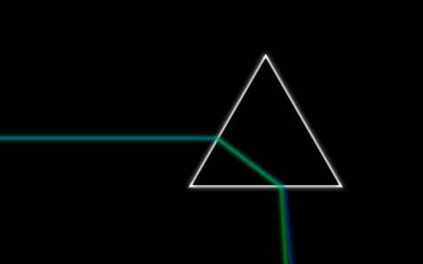

# Darkside - Light Dispersion Simulation



Darkside is a 2D light dispersion simulation that runs in the browser.

## Live Demo

A live demo is hosted at https://emilgedda.github.io/Darkside/demo

## Installation

To install the project, please run the following commands in the project root folder after cloning:

```bash
$ npm install   # install dependencies
$ npm run build # build project
```
This will generate a `index.html` file in the `dist` directory. Open it in your favorite browser to run the simulation.

## Unit Testing

To run all unit tests, please run `npm test` in the project directory.

## Licensing
Darkside is licensed under the MIT License © Emil Gedda & Anders Eriksson 2019. For more information see file [LICENSE](LICENSE).
